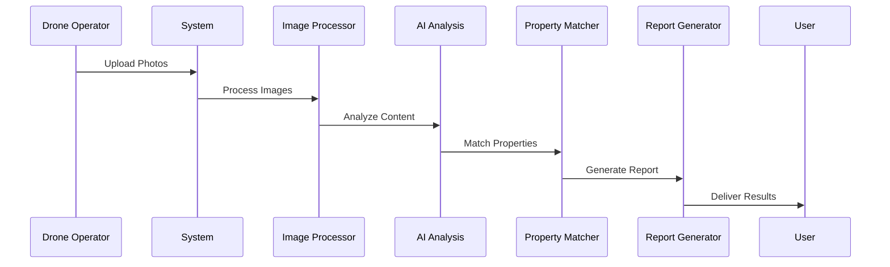
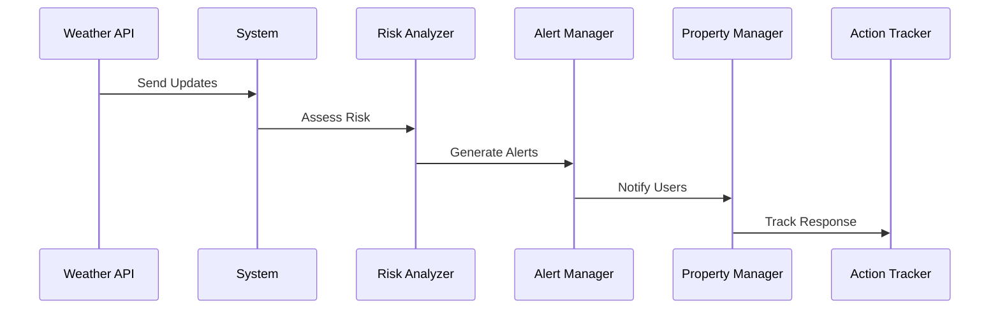

# CloudLens System Overview

## 1. Introduction

CloudLens is an advanced geospatial drone-powered platform designed for comprehensive property management and environmental risk assessment. The platform combines sophisticated geospatial processing, AI-driven image analysis, and advanced data extraction techniques to provide comprehensive property intelligence.

### 1.1 Purpose

The system serves multiple purposes:
- Automated property identification and assessment
- Drone imagery processing and analysis
- Environmental risk evaluation
- Property data management and reporting
- Weather impact assessment and monitoring

### 1.2 Target Users

- Property Managers
- Insurance Assessors
- Environmental Analysts
- Drone Operators
- Risk Assessment Teams

## 2. Core Functionalities

### 2.1 Property Management
- **Property Registration**
  - Address validation
  - Boundary mapping
  - Ownership verification
  - Historical data tracking

- **Property Monitoring**
  - Regular assessment scheduling
  - Change detection
  - Risk factor tracking
  - Compliance monitoring

### 2.2 Drone Image Processing
- **Upload Management**
  - Bulk photo upload
  - Automatic EXIF data extraction
  - GPS coordinate validation
  - Batch processing capabilities

- **Image Analysis**
  - AI-powered damage detection
  - Property feature identification
  - Environmental impact assessment
  - Historical comparison

### 2.3 Weather Integration
- **Real-time Weather Monitoring**
  - Current conditions display
  - Severe weather alerts
  - Historical weather data
  - Impact assessment

- **Weather-based Risk Assessment**
  - Storm tracking
  - Flood risk evaluation
  - Wind damage potential
  - Historical pattern analysis

### 2.4 Reporting and Analytics
- **Property Reports**
  - Condition assessments
  - Risk evaluations
  - Change tracking
  - Compliance status

- **Batch Analysis**
  - Multi-property comparisons
  - Regional assessments
  - Trend analysis
  - Risk pattern identification

## 3. User Roles and Permissions

### 3.1 Administrator
- Full system access
- User management
- System configuration
- Report generation
- API key management

### 3.2 Property Manager
- Property portfolio management
- Report access
- Image upload and review
- Basic analytics

### 3.3 Drone Operator
- Photo upload capabilities
- Basic property data access
- Assignment management
- Status reporting

### 3.4 Analyst
- Advanced analytics access
- Report generation
- Data export capabilities
- Trend analysis tools

## 4. System Workflows

### 4.1 Property Assessment Workflow
1. **Property Registration**
   - Address validation via Regrid API
   - Boundary mapping
   - Initial data collection

2. **Drone Photography**
   - Flight planning
   - Photo capture
   - Automatic upload
   - GPS validation

3. **Image Processing**
   - EXIF data extraction
   - Property matching
   - AI analysis
   - Damage detection

4. **Report Generation**
   - Data compilation
   - Analysis integration
   - PDF generation
   - Distribution

### 4.2 Weather Monitoring Workflow
1. **Data Collection**
   - Real-time weather updates
   - Historical data retrieval
   - Alert monitoring
   - Condition tracking

2. **Risk Assessment**
   - Pattern analysis
   - Threat evaluation
   - Impact prediction
   - Alert generation

3. **Response Planning**
   - Risk mitigation
   - Resource allocation
   - Stakeholder notification
   - Action tracking

## 5. Integration Points

### 5.1 External APIs
- **Regrid API**
  - Property data retrieval
  - Boundary information
  - Ownership details
  - Address validation

- **OpenAI Vision API**
  - Image analysis
  - Damage detection
  - Feature identification
  - Change detection

- **Weather APIs**
  - Current conditions
  - Forecasts
  - Historical data
  - Alerts

### 5.2 Internal Systems
- **Database**
  - PostgreSQL for data storage
  - Spatial data management
  - User information
  - Transaction logging

- **File Storage**
  - Image storage
  - Report storage
  - Temporary processing
  - Backup management

## 6. Features and Capabilities

### 6.1 Property Management
- Multi-property tracking
- Automated assessments
- Change detection
- Risk monitoring
- Compliance tracking

### 6.2 Image Processing
- Batch upload support
- Automated analysis
- AI-powered detection
- Historical comparison
- Quality assurance

### 6.3 Weather Monitoring
- Real-time updates
- Historical analysis
- Risk prediction
- Alert management
- Impact assessment

### 6.4 Reporting
- Custom report generation
- Batch processing
- Data visualization
- Export capabilities
- Automated distribution

## 7. Use Cases

### 7.1 Property Assessment

### 7.2 Weather Monitoring

## 8. Technical Requirements

### 8.1 System Requirements
- Node.js runtime
- PostgreSQL database
- Sharp image processing
- React frontend
- Express backend

### 8.2 API Dependencies
- Regrid API access
- OpenAI API key
- Weather API credentials
- Google Maps API key

### 8.3 Storage Requirements
- Image storage capacity
- Database storage
- Backup storage
- Temporary processing space

### 8.4 Processing Requirements
- Multi-threading support
- GPU acceleration
- Memory management
- Network bandwidth

## 9. Future Enhancements

### 9.1 Planned Features
- Enhanced AI analysis
- Mobile application
- Automated workflows
- Advanced reporting
- Integration expansion

### 9.2 Scalability Plans
- Horizontal scaling
- Performance optimization
- Storage expansion
- Processing enhancement

## 10. Support and Maintenance

### 10.1 System Monitoring
- Performance tracking
- Error logging
- Usage analytics
- Security monitoring

### 10.2 Maintenance Procedures
- Regular updates
- Data backup
- System cleanup
- Performance optimization
