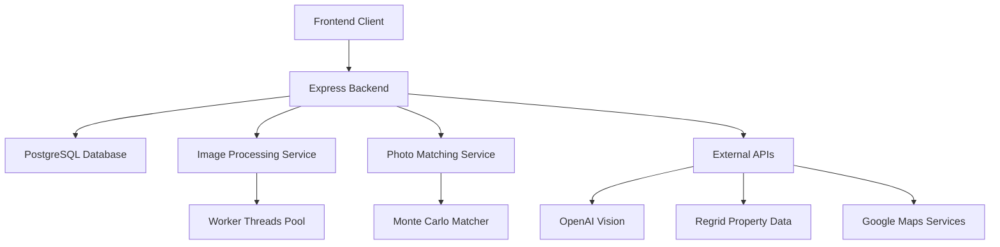

# CloudLens Technical Documentation

## System Architecture Overview

CloudLens is a sophisticated geospatial platform that combines drone imagery, AI analysis, and property data to provide comprehensive property management and risk assessment. The system is built on a modern stack consisting of:

### Core Technologies
- Frontend: TypeScript React with geospatial interfaces
- Backend: Express.js with PostgreSQL database
- ORM: Drizzle for type-safe database operations
- AI/ML: OpenAI Vision API for advanced image analysis
- Geospatial: Regrid API for property data
- Image Processing: Sharp for high-performance image operations
- Map Visualization: Deck.gl and Google Maps integration

### System Components


## Core Components Deep Dive

### 1. Image Processing Pipeline

The image processing pipeline (`server/image-processing.ts`) handles all photo-related operations using a worker thread architecture for optimal performance.

#### Key Components:
- **Thumbnail Generator**
```typescript
async generateThumbnail(imagePath: string): Promise<string | null> {
  // Uses Sharp with optimized settings:
  // - Auto rotation based on EXIF
  // - Efficient resizing with fastShrinkOnLoad
  // - Progressive JPEG with quality optimization
}
```

- **Worker Thread Management**
```typescript
// Maintains a pool of workers with configurable limits:
const MAX_CONCURRENT_WORKERS = 5;
const MAX_QUEUE_SIZE = 100;

// Worker message types for state management:
type ProcessingMessage = {
  type: 'progress' | 'complete' | 'error';
  status?: ProcessingStatus;
  progress?: number;
  results?: any;
};
```

#### Processing Flow:
1. Photo Upload
   - File validation and initial metadata extraction
   - Queueing for processing if worker pool is full
   
2. Worker Thread Processing
   - EXIF data extraction
   - GPS coordinate validation
   - Thumbnail generation
   - Metadata enrichment

3. Database Updates
   - Progress tracking
   - Status management
   - Error handling with retry mechanism

### 2. Photo Matching System

The photo matching system (`server/jobs/photo-matching.ts`) implements a sophisticated algorithm for associating photos with properties.

#### Matching Algorithm:
```typescript
interface MatchResult {
  propertyId?: number;
  confidence: number;
  matchMethod: string;
  matchFactors?: {
    gpsAccuracy?: number;
    addressSimilarity?: number;
    temporalConsistency?: number;
  };
}
```

#### Key Features:
1. **GPS Coordinate Validation**
   - WGS84 coordinate system validation
   - Accuracy threshold checking
   - Boundary validation

2. **Monte Carlo Enhanced Matching**
   - Probabilistic property boundary intersection
   - Temporal consistency checking
   - Batch photo correlation

3. **Confidence Scoring**
```typescript
const photoMatcher = new PhotoMatcher({
  confidenceThreshold: 0.8,  // Minimum confidence for auto-matching
  maxDistance: 100,         // Maximum distance in meters
  temporalWindowSize: 3600  // Time window for batch correlation
});
```

#### Matching Process Flow:
1. **Initial Processing**
   - Retrieve unassigned photos in batches
   - Extract and validate GPS coordinates
   - Group related photos by batch ID

2. **Property Matching**
   - Query nearby properties using spatial index
   - Calculate match probabilities
   - Apply temporal consistency checks

3. **Result Processing**
   - Update database with match results
   - Flag low-confidence matches for review
   - Handle edge cases and errors

### 3. Database Schema

The system uses a PostgreSQL database with the following core tables:

```sql
-- Photos table
CREATE TABLE photos (
  id SERIAL PRIMARY KEY,
  filename VARCHAR NOT NULL,
  originalName VARCHAR,
  mimeType VARCHAR,
  size INTEGER,
  userId INTEGER REFERENCES users(id),
  propertyId INTEGER REFERENCES properties(id),
  batchId INTEGER,
  metadata JSONB,
  processingStatus VARCHAR,
  matchMethod VARCHAR,
  propertyMatchConfidence FLOAT
);

-- Properties table
CREATE TABLE properties (
  id SERIAL PRIMARY KEY,
  address VARCHAR NOT NULL,
  latitude FLOAT,
  longitude FLOAT,
  boundary GEOMETRY(POLYGON, 4326),
  metadata JSONB,
  regridId VARCHAR
);
```

### 4. API Integration Details

#### OpenAI Vision API Integration
```typescript
const analyzePhoto = async (photoUrl: string) => {
  const response = await openai.chat.completions.create({
    model: "gpt-4-vision-preview",
    messages: [
      {
        role: "user",
        content: [
          { type: "text", text: "Analyze this property photo for damage:" },
          { type: "image_url", url: photoUrl }
        ],
      },
    ],
    max_tokens: 500,
  });
  return response.choices[0].message.content;
};
```

#### Regrid API Integration
The system integrates with Regrid's API for property data:
- Point-based property lookup
- Address validation
- Property boundary data
- Ownership information

Key endpoints:
- `/parcels/point` - Property lookup by coordinates
- `/parcels/address` - Property lookup by address
- `/parcels/area` - Boundary-based property search

### 5. Security Considerations

1. **File Upload Security**
   - MIME type validation
   - Size limits
   - Malware scanning
   - Secure storage paths

2. **API Security**
   - Rate limiting
   - API key rotation
   - Request validation
   - Error handling

3. **Data Privacy**
   - User data encryption
   - Secure deletion
   - Access control
   - Audit logging

## Performance Optimization

1. **Image Processing**
   - Worker thread pool for parallel processing
   - Optimized Sharp configuration
   - Caching and SIMD optimization
   - Progressive image loading

2. **Database**
   - Spatial indexing for property queries
   - Batch processing for photos
   - Connection pooling
   - Query optimization

3. **API Caching**
   - Property data caching
   - Weather data caching
   - Response compression
   - CDN integration

## Error Handling and Recovery

1. **Photo Processing Errors**
   - Automatic retries with backoff
   - Failed state tracking
   - Error logging and monitoring
   - Manual review flagging

2. **API Failures**
   - Fallback providers
   - Circuit breakers
   - Error reporting
   - Status monitoring

## Deployment and Scaling

The application is deployed on Replit with:
- Auto-scaling for worker threads
- Database connection pooling
- CDN for static assets
- Load balancing for API requests

### Monitoring and Maintenance

Key metrics monitored:
- Processing queue length
- Worker thread utilization
- API response times
- Error rates
- Storage usage

## Future Enhancements

Planned improvements include:
1. Enhanced AI analysis for damage detection
2. Real-time weather integration
3. Improved batch processing
4. Advanced property matching algorithms
