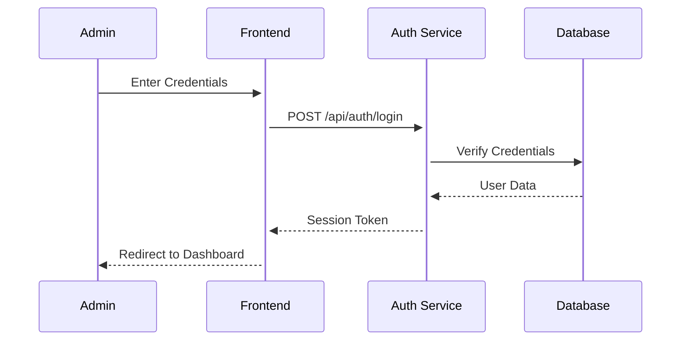

# CloudLens Detailed Workflow Guide

## 1. Authentication and Access Control

### 1.1 Admin Login Process


### 1.2 Session Management
- Session persistence using `express-session`
- Secure cookie handling
- Role-based access control (RBAC)

## 2. Batch Management and Photo Upload

### 2.1 Batch Creation
1. Admin initiates new batch:
   ```typescript
   interface BatchCreate {
     name: string;
     description: string;
     flightDate: Date;
     userId: number;
   }
   ```

2. System generates batch ID and metadata storage

### 2.2 Photo Upload Process
1. Bulk upload handling:
   - Drag-and-drop interface
   - Progress tracking
   - MIME type validation
   - Size limit enforcement

2. Initial processing:
   ```typescript
   interface PhotoProcessing {
     batchId: number;
     files: File[];
     metadata: {
       gps?: {
         latitude: number;
         longitude: number;
       };
       timestamp: Date;
       deviceInfo: string;
     }
   }
   ```

## 3. Address Resolution

### 3.1 Google Maps Integration
1. Reverse Geocoding:
   ```typescript
   async function resolveAddress(coords: {lat: number, lng: number}) {
     const geocoder = new google.maps.Geocoder();
     return await geocoder.geocode({
       location: coords
     });
   }
   ```

2. Address Validation:
   - Property boundary detection
   - Address standardization
   - Multiple match handling

## 4. Property Profile Management

### 4.1 Profile Creation
```typescript
interface PropertyProfile {
  address: string;
  coordinates: {
    latitude: number;
    longitude: number;
  };
  boundary: GeoJSON.Polygon;
  metadata: {
    propertyType: string;
    size: number;
    yearBuilt?: number;
  }
}
```

### 4.2 Photo Assignment
1. Automated matching:
   - GPS correlation
   - Timestamp analysis
   - Batch context

2. Manual override capabilities:
   - Drag-and-drop interface
   - Bulk assignment
   - Validation rules

## 5. Inspection Report Generation

### 5.1 Basic Report Creation
```typescript
interface InspectionReport {
  propertyId: number;
  inspectionDate: Date;
  inspector: string;
  status: 'draft' | 'complete';
  sections: {
    exterior: DamageAssessment[];
    roof: DamageAssessment[];
    structural: DamageAssessment[];
  }
}
```

### 5.2 Draft Management
- Autosave functionality
- Version tracking
- Conflict resolution
- Recovery system

## 6. Interactive Report Sharing

### 6.1 Shareable Link Generation
```typescript
interface ShareableReport {
  reportHash: string;
  expiryDate?: Date;
  accessCount: number;
  publicAccess: boolean;
}
```

### 6.2 Interactive Viewer Implementation
1. Animation Sequence:
   ```typescript
   interface ViewerAnimation {
     initialAltitude: number;
     zoomDuration: number;
     transitions: {
       start: Coordinates;
       end: Coordinates;
       duration: number;
     }[];
   }
   ```

2. Responsive Design:
   - Mobile-first approach
   - Touch gesture support
   - Progressive enhancement

### 6.3 Aerial View Animation
1. Implementation using Google Maps API:
   ```typescript
   function initializeAerialView(reportData: ReportData) {
     const map = new google.maps.Map(element, {
       zoom: 20,
       tilt: 45,
       heading: 0,
       center: reportData.coordinates
     });

     const animation = {
       startZoom: 0,
       endZoom: 20,
       duration: 3000,
       easing: 'cubic-bezier(0.4, 0, 0.2, 1)'
     };

     animateMap(map, animation);
   }
   ```

2. Smooth Transitions:
   - Altitude adjustment
   - Camera tilt
   - Heading rotation

### 6.4 Damage Presentation
1. Photo Carousel:
   ```typescript
   interface DamageSlide {
     photoUrl: string;
     description: string;
     severity: 'low' | 'medium' | 'high';
     recommendations: string[];
     timestamp: Date;
   }
   ```

2. Interactive Elements:
   - Zoom controls
   - Pan functionality
   - Damage annotations

### 6.5 Call-to-Action Integration
1. Contact Form:
   ```typescript
   interface RepairRequest {
     reportId: string;
     contactName: string;
     contactMethod: 'phone' | 'email';
     contactDetails: string;
     preferredTime?: Date;
     urgency: 'normal' | 'urgent';
   }
   ```

2. Tracking System:
   - Conversion tracking
   - Analytics integration
   - Follow-up automation

## 7. Technical Implementation Details

### 7.1 Frontend Architecture
```typescript
// Route Configuration
const routes = {
  dashboard: '/',
  propertyExplorer: '/property-explorer',
  propertyView: '/property/:id',
  batchManagement: '/batch-management',
  photoEditor: '/property/:id/photos/:photoId/edit',
  inspection: '/property/:id/inspection/:inspectionId?',
  report: '/report/:reportHash'
};

// Protected Route Implementation
function ProtectedRoute({ component: Component, adminOnly = false }) {
  const { user, isLoading } = useUser();
  
  if (isLoading) return <LoadingSpinner />;
  if (!user) return <Navigate to="/login" />;
  if (adminOnly && user.role !== 'admin') return <NotFound />;
  
  return <Component />;
}
```

### 7.2 Backend Services
1. Photo Processing Service:
   ```typescript
   class PhotoProcessor {
     async process(photo: UploadedPhoto): Promise<ProcessedPhoto> {
       const metadata = await this.extractMetadata(photo);
       const thumbnail = await this.generateThumbnail(photo);
       const geoData = await this.validateLocation(metadata.gps);
       
       return {
         ...photo,
         metadata,
         thumbnail,
         geoData
       };
     }
   }
   ```

2. Report Generation Service:
   ```typescript
   class ReportGenerator {
     async generate(propertyId: number): Promise<Report> {
       const property = await this.propertyService.get(propertyId);
       const photos = await this.photoService.getByProperty(propertyId);
       const assessments = await this.assessmentService.getForProperty(propertyId);
       
       return this.compileReport(property, photos, assessments);
     }
   }
   ```

### 7.3 Database Schema
```sql
-- Key tables for workflow management
CREATE TABLE reports (
  id SERIAL PRIMARY KEY,
  property_id INTEGER REFERENCES properties(id),
  status VARCHAR NOT NULL,
  created_at TIMESTAMP DEFAULT CURRENT_TIMESTAMP,
  updated_at TIMESTAMP DEFAULT CURRENT_TIMESTAMP,
  metadata JSONB,
  share_hash VARCHAR UNIQUE,
  view_count INTEGER DEFAULT 0
);

CREATE TABLE report_sections (
  id SERIAL PRIMARY KEY,
  report_id INTEGER REFERENCES reports(id),
  section_type VARCHAR NOT NULL,
  content JSONB,
  order_index INTEGER
);
```

### 7.4 API Endpoints
```typescript
// Core API routes
const apiRoutes = {
  auth: {
    login: 'POST /api/auth/login',
    logout: 'POST /api/auth/logout',
    session: 'GET /api/auth/session'
  },
  properties: {
    create: 'POST /api/properties',
    update: 'PUT /api/properties/:id',
    delete: 'DELETE /api/properties/:id',
    list: 'GET /api/properties'
  },
  photos: {
    upload: 'POST /api/photos/upload',
    process: 'POST /api/photos/:id/process',
    assign: 'PUT /api/photos/:id/assign'
  },
  reports: {
    create: 'POST /api/reports',
    update: 'PUT /api/reports/:id',
    share: 'POST /api/reports/:id/share',
    view: 'GET /api/reports/:hash'
  }
};
```

## 8. Security Considerations

### 8.1 Authentication Security
- JWT token management
- CSRF protection
- Rate limiting
- Session timeout handling

### 8.2 Data Privacy
- End-to-end encryption for sensitive data
- Data retention policies
- Access logging
- GDPR compliance measures

### 8.3 API Security
- Input validation
- Request sanitization
- Error handling
- API key rotation

## 9. Performance Optimization

### 9.1 Image Optimization
- Progressive loading
- Lazy loading
- Format optimization
- Caching strategy

### 9.2 Animation Performance
- Request animation frame usage
- GPU acceleration
- Asset preloading
- Memory management

## 10. Monitoring and Analytics

### 10.1 System Monitoring
- Error tracking
- Performance metrics
- Usage statistics
- API response times

### 10.2 User Analytics
- Conversion tracking
- User journey analysis
- Feature usage metrics
- Performance impact
